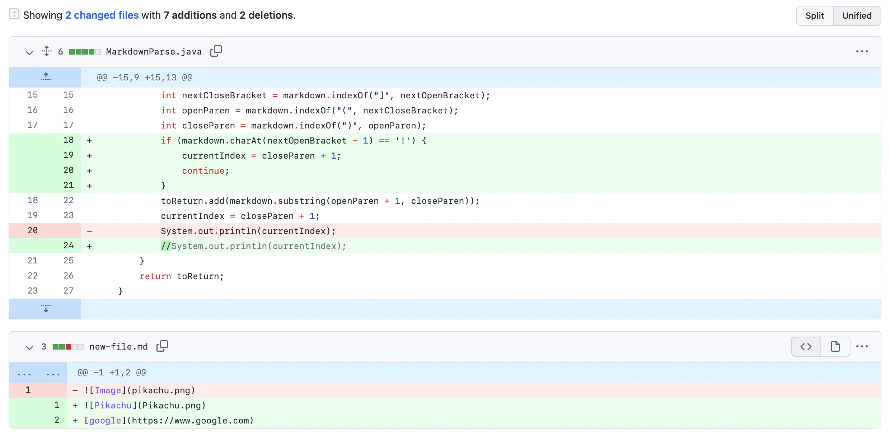
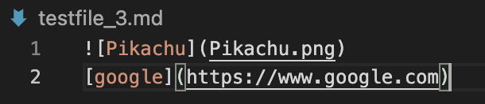
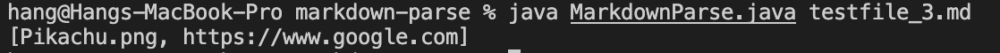
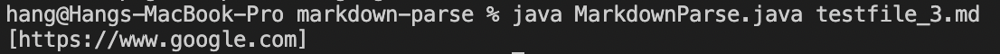
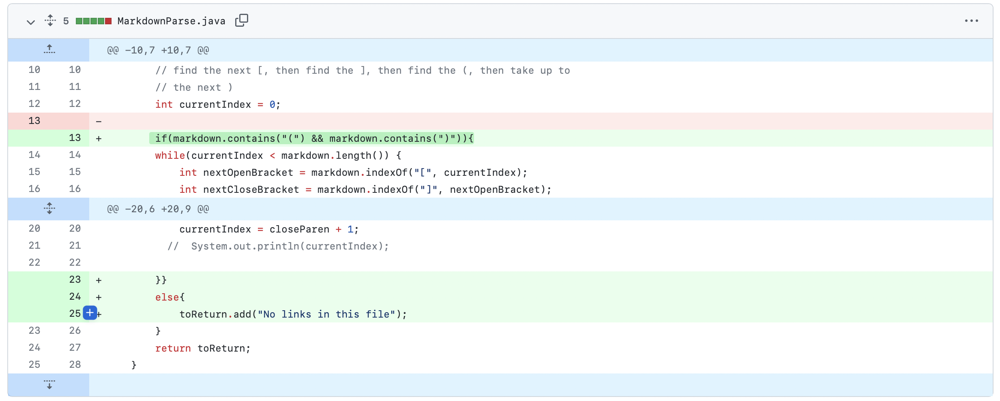
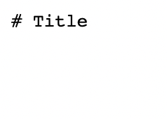
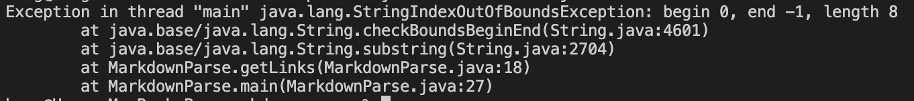
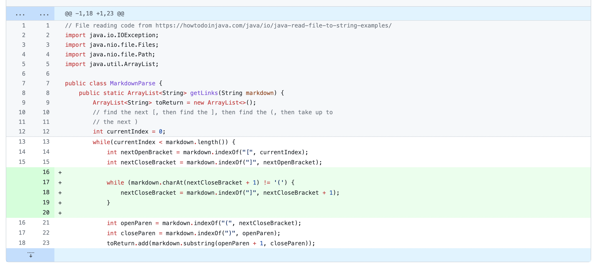
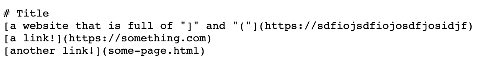
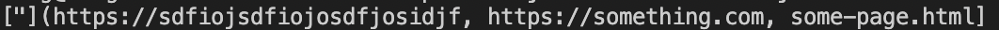

# **_LAB REPORT 2_**
# **Three codes with bugs fixed** 

## **First One - Hang Liu**
Screenshot of the code change difference from Github: 
> 
_Notes: Green means the code added, and red means codes deleted._

The link to the test file that lead to this change: 
 [HangLiuTestFile](https://github.com/HangLiu01/markdown-parse/blob/main/testfile_3.md)
 
This is the raw code what should look like: 
> 

This is waht looks like when it failed: 
> 

We find that it includes the image code as well. From the output we can realize that does not see the difference between a image and web link in markdown format. So with the if statement added, it can run successfully. 

This is what looks like after bug fixed: 
> 

---
## **Second - Amanda Kristanto**
Screenshot of the code change difference from Github: 
> 
_Notes: Green means the code added, and red means codes deleted._

The link to the test file that lead to this change: 
 [AmandaTestFile](https://github.com/ajkristanto/markdown-parse/blob/main/empty-file.md)
 
This is the raw code what should look like: 
> 

This is waht looks like when it failed: 
> 

We find that it is out of bound because the code doesn't know what to do if they did not find the brackets and parentheses. Therefore, Amamda added a if statement to so that it wwill try unless the code finds a parentheses in it. 

---
## **Third - Peter Zhong**
Screenshot of the code change difference from Github: 
> 
_Notes: Green means the code added, and red means codes deleted._

The link to the test file that lead to this change: 
 [PZ](https://github.com/pz2105/markdown-parse/blob/main/lab2_thirdTestFile.md)
 
This is the raw code what should look like: 
> 

This is waht looks like when it failed: 
> 

We find that it does not distinguish when there are multiple brackets and parentheses in the decription box of a image code in markdown. So it limits the code to strict it with the link only with `(` after a closed bracket. 
