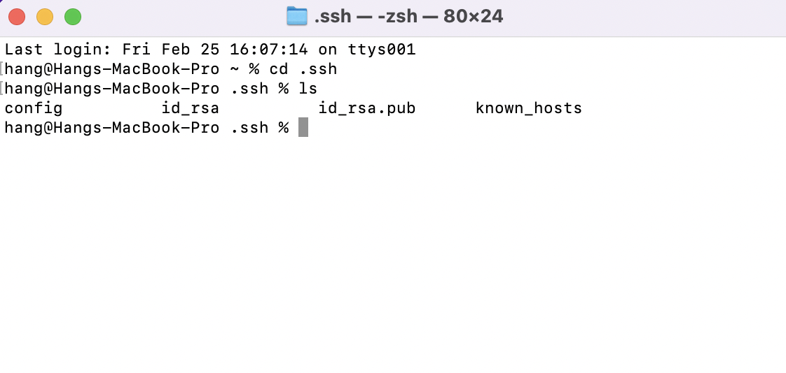
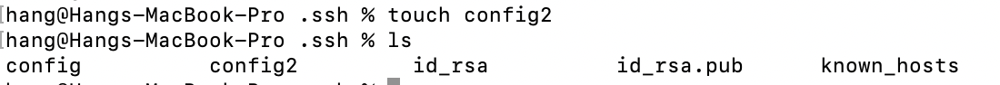
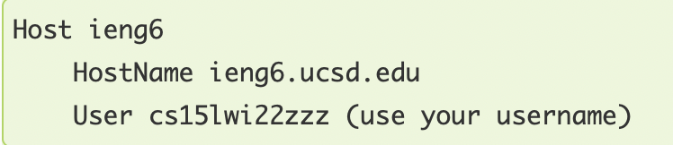
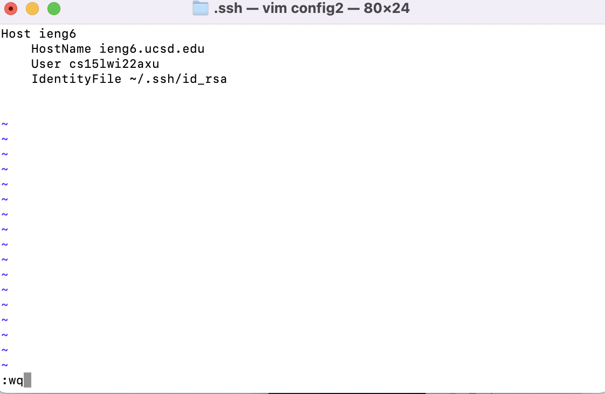
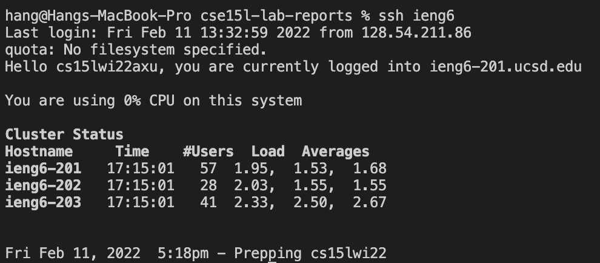

# **_LAB REPORT 3_**
# **Streamlining SSH configuration

Streamlining SSH configuration is a easier and more convenient way to connect remote server. 

First, we need to find/add configuration file in your computer's ssh folder. 

Go to your computer's bash or terminal and type
> _`cd .ssh`_

Use my computer as an example, I opened the terminal on mac, and entered the above code:
> 

Find your config file. If not, create one first. Typre `"touch NAME"` in your terminal. Replace the name with the name you want. Here is my example:
> 

And then, to edit through terminal, you may want to type `vim + Name`. replace name with your file name. 
Then type: 
> 
_Tips: you can change the name after Host to name whatever you like.

After you finish editing, press `ESC` then type `:wq` and hit enter to save and quit the file:
>
_

Now, you are able to log on the remote code with a simplier command: 
> 

Lastly, lets try to use the host name we create to move some files!
Try: 
> `scp (your filename) (host name)`

This is the example I have: 
> 

