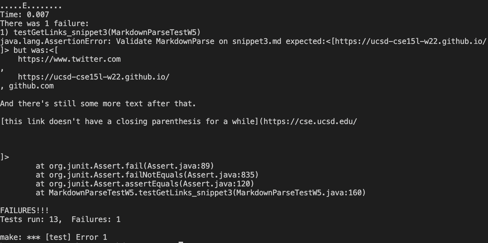

# **_LAB REPORT 4_**

## **Lab Repository**
Here is the link to my repository:
[Hang Liu](https://github.com/HangLiu01/markdown-parse). And this is the one for the one I reviewed: 
[Maotcha](https://github.com/maotcha/markdown-parse).
<br/><br/>

## Snippet1
---
By VSCode preview:
> 
It should produce an arraylist with three links in it ```[`google.com, google.com, ucsd.edu].```

Below is the test for snippet 1:
> 

And I get the output:
> 

To look closer, this is the specific part that JUnit output that shows the test failure:
> 

Below is the test for Maotcha's snippet1:
> 

After running the test, I get the output which is specific enough:
> 


## Some thoughts on my code towards Snippet 1:
As we can see it returns `url.com` and miss `ucsd.edu` I do not think a small change or one step change can make my code works for snippet1. 

For the `url.com`, it is easy. I need to add more one more condition on my if statement. Thus, it will not include url.com anymore. But for the last one, I am a bit comfused because I after the close bracket, it should find the open parentheses straightly. So no matter what is after the close bracket, even there is another one, it should ignore and jump to find the location of open parentheses and close parentheses. So I am not 100% sure where I make a mistake. But I think a easier way is to add morerestriction on finding the location of parentheses and extrac from link.<br/><br/>


## Snippet2
---
By VSCode preview:
> 
It should produce an arraylist with three links in it ```[a.com, a.com(()), example.com].```

Below is the test for snippet 2:
> 

And I get the output:
> 

To look closer, this is the specific part that JUnit output that shows the test failure:
> 

Below is the test for Maotcha's snippet2:
> 

After running the test, I get the output which is specific enough:
> 

## Some thoughts on my code towards Snippet 2:

Really nasty example code, I have to say. To be hoenst, again, I do not think a easy step can make my code work for snippet 2. For `a.com(())`, it is easier. Because I just need to make my code extract what every in the first occured open parentheses and last close parentheses. Here, my code stopped at the first occured close parentheses and that is why it does not include the close parentheses in the link. For the first one. Similar to the thrid link, I should include the first occured open bracket and last occured close bracket. The first one is triky because the markdown system actually because it actually do not count the first occured open bracket. So for this one, I have to modify the code to only serve for this type of code. It will no work for other similar type of codes. 
<br/><br/>

## Snippet3
---
By VSCode preview:
> 
It should produce an arraylist with one link in it ```[https://ucsd-cse15l-w22.github.io/].```
I think a successful link in markdown should only blue the words in brackets, and the link is given to the words in bracket. So although `www.twitter.com` and `https://cse.ucsd.edu/` is blue as well, it may be because they are real websites and you can just type it out as valid link. But follow the format we have learned, those two are actually not real links. So I will not consider them in the output. 

Below is the test for snippet 3:
> 

And I get the output:
> 

To look closer, this is the specific part that JUnit output that shows the test failure:
> 

Below is the test for Maotcha's snippet2:
> 

After running the test, I get the output which is specific enough:
> 

<br/><br/>


## Some thoughts on my code towards Snippet 3:
It will not be done in one step or a simple change. 
Snippet 3 includes multiple lines and spaces in the code. And we know that a space or a line actually contains codes in it. So if we delete those extra lines in the open bracket, the code for link will work. Therefore, to make the MarkdownParse works, we need to add more conditions in the if-statement. For example, detect if there are multilple lines within the brackets. If exists, ignore whatever is in the parentheses. Also, check the completeness of a code, such that an open bracket has a close bracket, and an open parentheses has a close parentheses. 