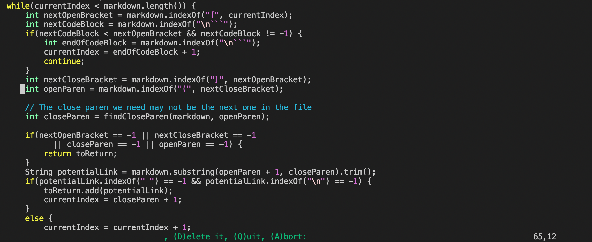

# **_LAB REPORT 4_**

## **How to find tests with different results**

I use method `diff` to find the tests with different results. 
I have `results.txt` from the teacher's version of `markdown-parse`. And the same name `results.txt` from my own `markdown-parse` directory. 

Here is the code:
> 

As you can see, the paths for two different `results.txt` are different. The first one is Professor Joe's version and the second is mine. 
Here is the short example of what the output looks like:

> 
---

## Test 1:
Let's first take a look at test 1:
> 

It means that the difference occurs on line `212` of the document `results.txt`. 
Using `vim` to find the line 212 of `results.txt`, we find:
> 
which means the difference happens in file `194.md`

Now, using `cat` to check what is in the file:
> 

As you can see, the correct answer should be empty because there is no valid link in this file. So we know that Professor's code makes some mistakes. 
Before we actually looking into the code, we can guess that professor's code has something wrong with checking the validity of an input. I would say probably the if-statement needs to change. 
Below is professor's `MarkdownParse.java`:
> 

So I think the issue occurs at line 65, where the cursor is at on the screenshot, Professor's code finds the open parentheses without check anything between them. But we know that a valid link code would not accept anything between it. So I think this is the part that needs to change. Probably add more information when finding the open parentheses. 

---
## Test 2:
Let's first take a look at test 2:
> 

Now, let's using the same method to look at line `270` in the file. 
> 
which means the difference happens in file `22.md`

Now, using `cat` to check what is in the file:
> 

Again, from the file, we can tell that the correct output should be `/bar\* "ti\*tle`, so the student version is correct again. Let's take a look at professor's code again. 
I think the problem may occur when the code is trying to find the close paren. Below is the professor's code for finding the close paren:
> 

I try to follow the logic here but always lost through half way. Professor's main code (the one from part 1) looks right and should not occur error. So I think the problem may happens here. Probably the `\*` or the space have something special meaning to the system and thus sign the close paren to -1? These are just guesses. But I think we should start from here and try. 