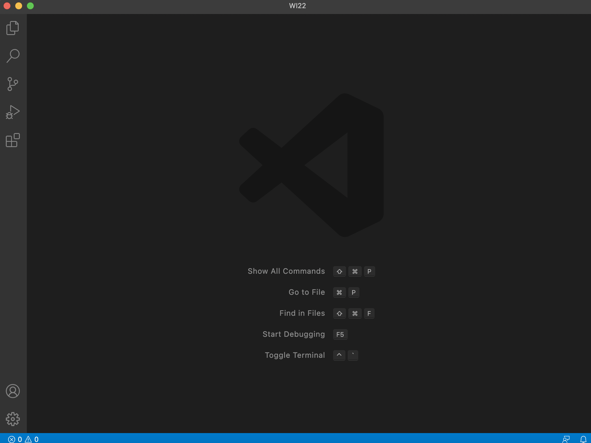
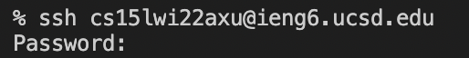
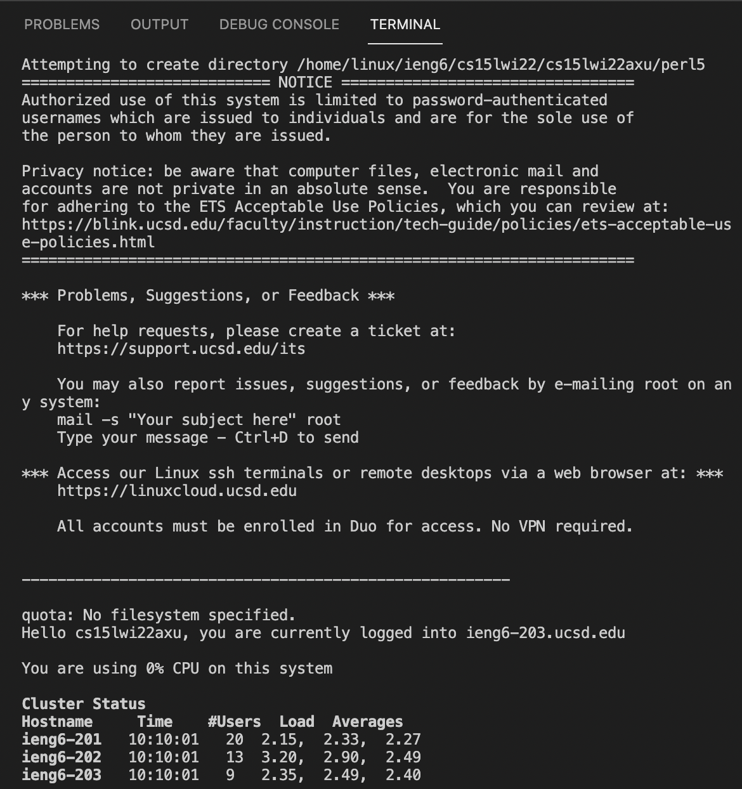
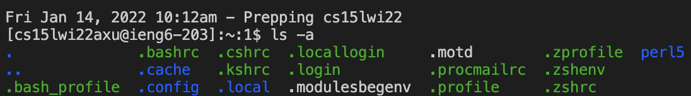
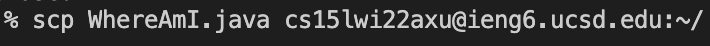
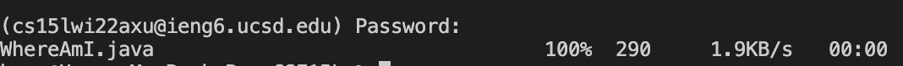
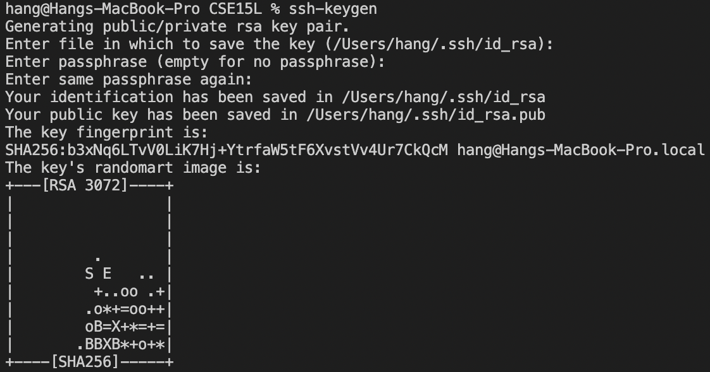
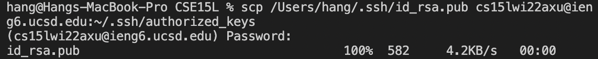
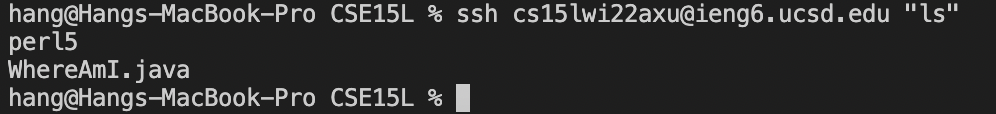

# **How to Log Into a course-specific account on @ieng6**
## **Step 1 - Installing VScode**
Visit VScode official website [https://code.visualstudio.com](https://code.visualstudio.com) to download and install. It provides several different versions. You should be able to find the one for your computer. Here is the screenshot you should see after you download and open it. 

 

---
## **Step 2 - Remotely Connecting**
If you are on Windows, you need to download and install a program called OpenSSH, which is to connect your computer to other computers. Here is the link: [OpenSSH](https://docs.microsoft.com/en-us/windows-server/administration/openssh/openssh_install_firstuse).
Next, find your course-specific account for CSE15L using this: [https://sdacs.ucsd.edu/~icc/index.php](https://sdacs.ucsd.edu/~icc/index.php)

Then, open a terminal in VScode and enter the following code (But instead of 'axu', replace your own course-specific code):

> 

If you connect to the remote computer successfully, you should see the image below. 

> 

---
## **Step 3 - Trying Some Commands**

Here are some commands you can try on your terminal:
* `cd`
* `cd~`
* `ls -a`
* `ls -lat`

Here is an example of `ls -a`: 
> 

Try some other commands on your local computer and remote server. 

---
## **Step 4 - Moving Files with `scp`**
You can use `scp` command to move a file from your computer to a remote computer. 

Create a random file and try the below code. 
> 
Replace the file name with the one you created. 

Enter the password and this is what you should see after move successfully. 
> 

---

## **Step 5 - Setting an SSH Key**
Using SSH keys, we do not need to enter the password every time we run `ssh` and `scp`.

First, run the following code on `your own computer`.
> `ssh-keygen`

This will generate a pair of keys and save it on your computer. It will also ask for the directories to store in. You can jut press enter to put it in a default set. Here is what should look like: 
> 

Next, log on the remote server and run:
> `mkdir .ssh`

Finally, log out and back to your local computer, and run the following code: 
> `scp /Users/**YOUR USERNAME**/.ssh/id_rsa.pub cs15lwi22@ieng6.ucsd.edu:~/.ssh/authorized_keys`

`REPLACE with your own user name and course-specific account.`

This is what should look like: 
> 

Now, you are able to log on ssh and use scp command without entering password. 

---
## **Step 6 - Optimizing Remote Running**
Now, you should be able to run command on your remote server by entering it after your `ssh` command. For example:
> 

You can also try to move files without login follow the similar code. 

---
## **The END**

Please enjoy this class!